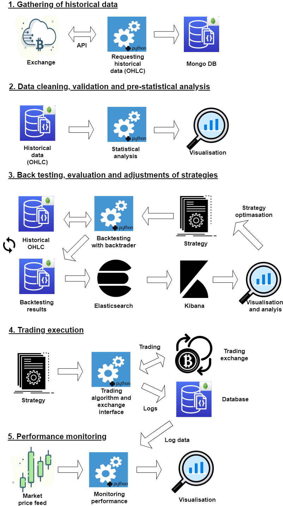

# Algorithmic trading of currency pairs (example uses the cryptocurrency market)

I would like to share a little inside in what I was working on recently (see below).
A whole infrastructure for data gathering, cleaning, strategy backtesting, trade execution and performance monitoring.

